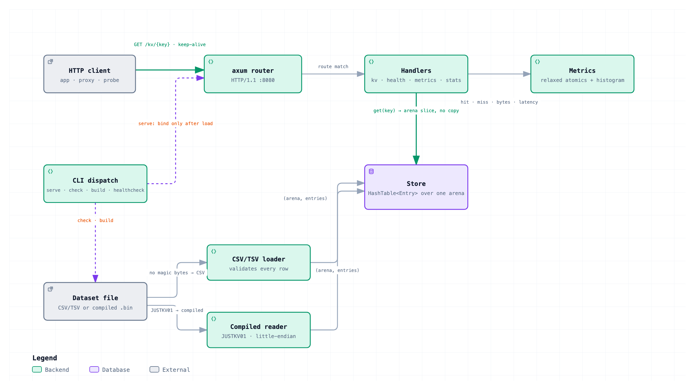

# justkv

A read-only key-value server. It loads a dataset into memory at startup and
serves lookups over HTTP/1.1. The data never changes at runtime.

That single constraint shapes everything. An immutable map needs no locks, no
sharding, and no synchronization on the read path — most key-value store
complexity exists to serve writes, and none of it is needed here.



*(An interactive version — pan, zoom, search, guided walkthroughs, and links
back to the source lines — lives in [`docs/architecture.html`](docs/architecture.html).)*

## How it works

All keys and values live in **one contiguous byte arena** held as a `Bytes`. A
`hashbrown::HashTable` of 16-byte `(k_off, k_len, v_off, v_len)` entries indexes
into it. So a lookup returns `arena.slice(..)` — a refcount increment, not a
copy — and serving a 100 KB value costs the same as a 10-byte one.

At 1M keys that layout costs ~16 MB of index, against ~50–60 MB for a
`HashMap<Box<[u8]>, Bytes>` with its per-entry allocations.

Two loaders — CSV/TSV and a compiled binary format — converge on one
`Store::from_parts`, so table construction, lookup, and stats are shared code. A
property test round-trips arbitrary datasets through both and asserts identical
arenas and identical results, which turns "two load paths to maintain" into one
invariant to hold.

## Quick start

```sh
cargo build --release

# Serve a CSV/TSV directly — good for development.
./target/release/justkv serve --data data/example.tsv

curl localhost:8080/kv/alpha      # -> 1
curl -i localhost:8080/kv/absent  # -> 404
```

For production, compile the dataset first. It loads ~4x faster:

```sh
./target/release/justkv check data/example.tsv   # every problem, with line numbers
./target/release/justkv build data/example.tsv -o kv.bin
./target/release/justkv serve --data kv.bin
```

The server detects the format from the file's magic bytes, so `--data` accepts
either without a flag.

## HTTP API

| Route | Behavior |
|---|---|
| `GET /kv/{key}` | Percent-decoded path segment. The primary form. |
| `GET /kv?k={key}` | Escape hatch for keys containing `/` or awkward bytes. |
| `GET /health` | `200 "ok"`, reachable only after loading completes. |
| `GET /metrics` | Prometheus text format. |
| `GET /stats` | JSON: key count, arena bytes, source, format, load time, uptime. |

Both `/kv` forms exist because `%2F` in a path is unreliable — many proxies
decode it before routing, turning `/kv/a%2Fb` into a nested path request.

A hit returns `200` with `Content-Type: text/plain; charset=utf-8` and a body
sliced from the arena. A miss returns `404`, or, if `--default-value` is set,
`200` with that value and an `X-JustKV-Default: 1` header.

**A default-served response counts as a miss in metrics, never a hit.**
Configuring a default makes `GET` total, which removes the miss signal from the
status code. The status may be deliberately forgiving; the observability must
not be.

## Subcommands

```
serve        Load a dataset and serve it over HTTP
check        Validate a dataset and exit; reports every problem found
build        Compile a CSV/TSV dataset into the binary format
healthcheck  Probe a running server's /health endpoint
```

`check` reports **every** problem with line numbers rather than failing on the
first, and exits `0` clean, `1` validation errors, `2` I/O error. It catches
duplicate keys (naming both line numbers), wrong column counts, unparseable
rows, and values that are not valid UTF-8.

`healthcheck` exists because the runtime image is `FROM scratch` and has no
shell or curl to run a health probe with.

## Configuration

| Flag | Env | Default |
|---|---|---|
| `--data` | `JUSTKV_DATA` | required for `serve` |
| `--bind` | `JUSTKV_BIND` | `0.0.0.0:8080` |
| `--default-value` | `JUSTKV_DEFAULT` | unset (404 on miss) |
| `--content-type` | `JUSTKV_CONTENT_TYPE` | `text/plain; charset=utf-8` |
| `--delimiter` | — | inferred from extension |
| `--header` | — | false |
| `--allow-binary` | — | false |
| `--workers` | — | core count |
| `--no-metrics` | — | false |

CLI flag beats environment variable beats built-in default.

In a container, set `--workers` to match the CPU quota. Left at the default it
sizes the tokio pool from the host's core count and thrashes against the cgroup.

## Container image

```sh
./scripts/pack.sh --data data/example.tsv --tag justkv:v1
```

Three stages: build a static musl binary, validate and compile the dataset, then
copy both into `FROM scratch`. Expect ~3 MB.

The middle stage is the point: it runs `check` and then `build`, so a duplicate
key or a malformed row **fails `docker build`** rather than crash-looping a
production pod.

## Performance

Measured on a k3s cluster against a 1,000,000-key dataset. Full method, caveats,
and the figures that were discarded are in [`bench/README.md`](bench/README.md).

| | |
|---|---|
| Single-core saturation | **21,872 req/s** at 94% CPU, p99 9.22 ms |
| Four cores | ≥ 32,298 req/s sustained — a floor; the server was only 60% busy |
| Steady state | 2,000 req/s at p99 0.60 ms |
| Memory | 74 → 78 MiB RSS across 2.4M requests (~36 MiB arena) |
| Startup | 141 ms compiled, 548 ms CSV, at 1M keys |

At saturation the server queues rather than collapses: latency degrades and the
generator stops keeping up, but **no request fails**.

## Design notes

The [design spec](docs/superpowers/specs/2026-09-13-justkv-design.md) records the
decisions and, more usefully, the rejected alternatives — RESP and gRPC,
thread-per-core with `SO_REUSEPORT`, `mmap`, perfect hashing, and compile-time
embedding — with the reasoning for each.

Known limits: `u32` offsets cap a dataset at 4 GB; CSV loading costs a transient
~2x memory; metrics timing adds ~40 ns per request; and there is no TLS or
authentication, which belong to a reverse proxy.

## Non-goals

Writes, deletes, TTL, replication, clustering, persistence, authentication, TLS,
and batch lookup.
